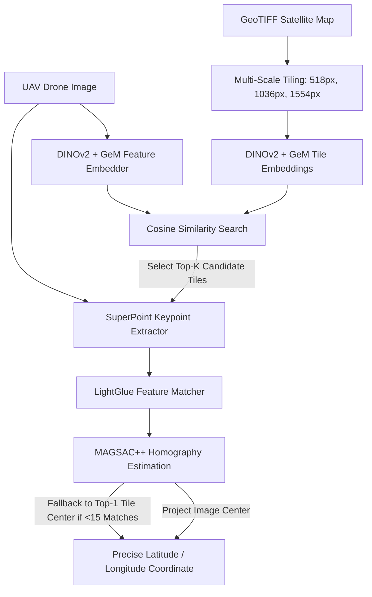

# UAV Visual Localization via DINOv2 & SuperPoint + LightGlue

[](https://www.python.org/)
[](https://pytorch.org/)
[](https://github.com/facebookresearch/dinov2)
[](https://github.com/cvg/LightGlue)

A high-precision cross-view visual localization framework for Unmanned Aerial Vehicles (UAVs) matching aerial drone imagery against high-resolution georeferenced satellite maps without relying on GPS signals.

---

## Method Overview

The visual localization pipeline follows a coarse-to-fine hierarchical retrieval strategy:



1. **Multi-Scale Satellite Tiling:** The input satellite GeoTIFF is sliced into overlapping tiles across multiple spatial scales (`518px`, `1036px`, `1554px`) with a 50% stride to handle varying flight altitudes.
2. **Coarse Global Retrieval:** Global image descriptors are extracted using a pre-trained **DINOv2 (ViT-B/14 with registers)** backbone enhanced with **GeM (Generalized Mean) Pooling** and normalized via L2. Top-$K$ candidate tiles are retrieved via cosine similarity.
3. **Fine Local Matching & Geolocalization:** Keypoints are extracted using **SuperPoint** and matched against candidate tiles using **LightGlue**. A robust **MAGSAC++** homography matrix ($H$) projects the drone image center to exact pixel coordinates on the satellite map, which are transformed into spatial coordinates ($\text{Lat}, \text{Lon}$) via GIS affine transformations.

---

## 📊 Benchmark & Performance Metrics

> [!NOTE]
> Evaluation evaluated on the **UAV-VisLoc Dataset (Subset 06)**.

| Metric | Value | Description |
| :--- | :---: | :--- |
| **Mean Haversine Error (MHE)** | `[INSERT MHE HERE]` | Average distance error in meters between predicted and ground-truth coordinates |
| **Median Distance Error** | `[INSERT MEDIAN ERROR HERE]` | Median localization error |
| **Recall@1** | `[INSERT R@1 HERE]` | Percentage of queries where Top-1 tile contains GT location |
| **Recall@5** | `[INSERT R@5 HERE]` | Percentage of queries where Top-5 tiles contain GT location |
| **Recall@10** | `[INSERT R@10 HERE]` | Percentage of queries where Top-10 tiles contain GT location |
| **Homography Inlier Ratio** | `[INSERT INLIER RATIO HERE%]` | Average percentage of valid MAGSAC++ inliers for successful matches |
| **Inference Time / Image** | `[INSERT TIME HERE]` | Total end-to-end processing time per query frame on NVIDIA T4/RTX 3090 |

### Error Distribution & Threshold Metrics

| Error Threshold | Accuracy (%) |
| :--- | :---: |
| **$\le$ 5 meters** | `[INSERT %, e.g. 45.2%]` |
| **$\le$ 10 meters** | `[INSERT %, e.g. 72.8%]` |
| **$\le$ 25 meters** | `[INSERT %, e.g. 91.5%]` |
| **$\le$ 50 meters** | `[INSERT %, e.g. 97.1%]` |

---

## 📁 Repository Structure

```text
UAV_VisLoc/
├── config.yaml              # Global project parameters and hyperparameters
├── uav_visloc/              # Core Python package
│   ├── __init__.py
│   ├── dataset.py           # Single & Triplet PyTorch Datasets + Auto-downloader
│   ├── models.py            # DINOv2 Embedder, GeM Pooling, Triplet Trainer & LightGlue Refiner
│   └── utils.py             # Multi-scale tile cutter, Haversine metric & Visualization helpers
├── notebooks/               # Jupyter / Google Colab demo notebooks
│   └── hubin_uav_visloc.ipynb
└── README.md                # Project documentation
```

---

## 🛠️ Installation & Setup

### Prerequisites
- Python 3.10+
- PyTorch 2.0+ with CUDA support
- GDAL / Rasterio for GeoTIFF GIS processing

### Installation

1. **Clone the repository:**
   ```bash
   git clone https://github.com/your-username/UAV_VisLoc.git
   cd UAV_VisLoc
   ```

2. **Install dependencies (using `uv` or `pip`):**
   ```bash
   # Using uv (Recommended)
   uv venv
   source .venv/bin/activate  # On Windows: .venv\Scripts\activate
   uv pip install -r requirements.txt

   # Or standard pip & LightGlue
   pip install torch torchvision --index-url https://download.pytorch.org/whl/cu118
   pip install git+https://github.com/cvg/LightGlue.git
   pip install rasterio pandas matplotlib Pillow pyyaml tqdm requests opencv-python
   ```

---

## ⚙️ Configuration (`config.yaml`)

All parameters are configured via `config.yaml`:

```yaml
dataset_link: https://huggingface.co/datasets/nikon942/UAV-VisLoc-Folder06/resolve/main/data_06.zip

data_folder: data
raw_folder: raw
extract_folder: uav
zip_file_name: 06_folder.zip

tile_scales: [518, 1036, 1554]

train_folders: [6]
test_folders: [6]

drone_res_height: 1036
drone_res_width: 518

top_k: 10
seed: 42
```

---

## 🚀 Quickstart & Usage

### 1. Run Complete Training, Inference & Evaluation

To automatically download the dataset (Subset 06), train the GeM fine-tuning head with Triplet Margin Loss, retrieve candidate satellite tiles, refine localization with LightGlue, and plot visualizations:

```bash
python uav_visloc/models.py
```

### 2. Run Dataset Downloader Directly

```bash
python uav_visloc/dataset.py
```

---

## 🧪 Pipeline Output Visualizations

The pipeline generates interactive diagnostic plots:
- **Top-K Tile Retrieval:** Visualizes the query drone image alongside the Top-$M$ highest-scoring satellite tiles.
- **Keypoint Homography & Pose Refinement:** Highlights matched SuperPoint inliers (lime points) and marks predicted GPS ground coordinates (red cross) overlaid on satellite tiles.
